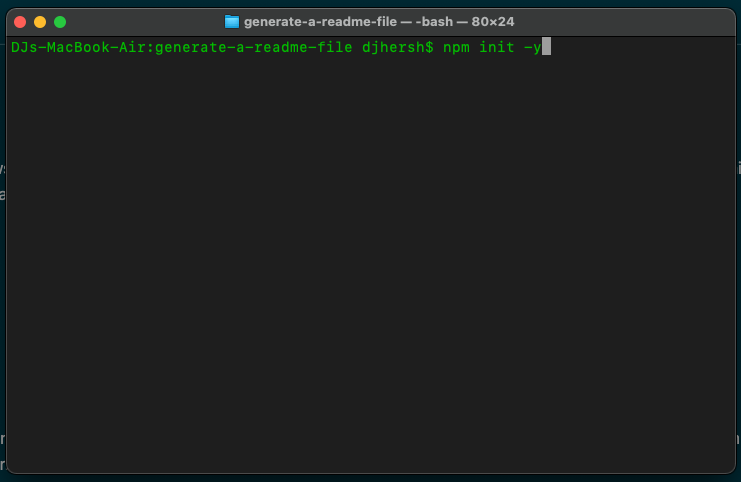
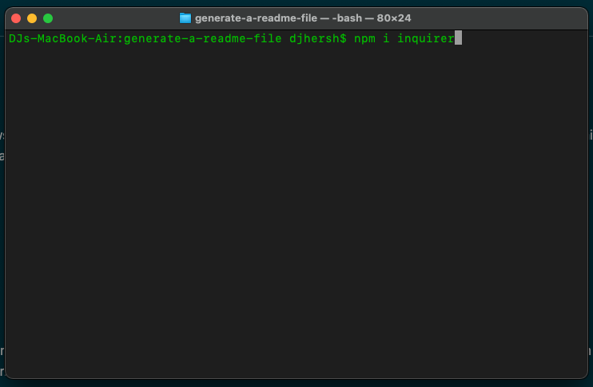

# Team Profile Generator

## Description

This is an application to be used by a company desiring to create a website with profiles of their team members. It allows the user to answer pre-determined questions on the command line of their computer and dynamically creates each profile using the input. Once all profiles have been created, an HTML file is written and placed in the 'output' folder containing each of the profiles.

The code used to create this application has passed all given tests, using the npm package 'Jest'.

## Usage

To use this application, you must have Node.js on your system, and download the npm package 'Inquirer'. To do this, open your terminal, navigate to the proper file, and type in 'npm init -y'. The '-y' is optional, but streamlines the process by naming the file based on the parent folder. This process will create a package.json file within your root directory.

Once you have created the package.json, go back to the terminal and type 'npm i inquirer' and hit enter. This will download the Inquirer package onto your computer and store it in the root directory of your file structure. 

Once you have completed these steps, go back once again to the terminal, and type in 'node app.js' and answer each of the prompts with the information for each team member. Once you have finished, you will see an html file in the 'output' folder with the name 'team.html' that has all of the information for the team member profiles inside.

For a video walk-through of this process, click the following link:

https://drive.google.com/file/d/1Gz5ZLSw4NBE1iVbLbkXTJ7AIPG6JzHsy/view

## Credits

First I must credit the UCLA Extension Full-Stack Web Development Coding Bootcamp, instructor Bryan Swarthout, and TA Wilson Lam for providing me with all of the tools and knowledge I used to build this application.

http://www.uclaextension.edu

The npm package "Inquirer" is the main resource at work for this application.

https://www.npmjs.com/package/inquirer

## Questions

For any questions, I, DJ Hersh, can be contacted via email at DanielJHersh@gmail.com

My GitHub profile is located at https://github.com/DJ620

## License

MIT License

Copyright (c) [2020] [DJ Hersh]

Permission is hereby granted, free of charge, to any person obtaining a copy
of this software and associated documentation files (the "Software"), to deal
in the Software without restriction, including without limitation the rights
to use, copy, modify, merge, publish, distribute, sublicense, and/or sell
copies of the Software, and to permit persons to whom the Software is
furnished to do so, subject to the following conditions:

The above copyright notice and this permission notice shall be included in all
copies or substantial portions of the Software.

THE SOFTWARE IS PROVIDED "AS IS", WITHOUT WARRANTY OF ANY KIND, EXPRESS OR
IMPLIED, INCLUDING BUT NOT LIMITED TO THE WARRANTIES OF MERCHANTABILITY,
FITNESS FOR A PARTICULAR PURPOSE AND NONINFRINGEMENT. IN NO EVENT SHALL THE
AUTHORS OR COPYRIGHT HOLDERS BE LIABLE FOR ANY CLAIM, DAMAGES OR OTHER
LIABILITY, WHETHER IN AN ACTION OF CONTRACT, TORT OR OTHERWISE, ARISING FROM,
OUT OF OR IN CONNECTION WITH THE SOFTWARE OR THE USE OR OTHER DEALINGS IN THE
SOFTWARE.